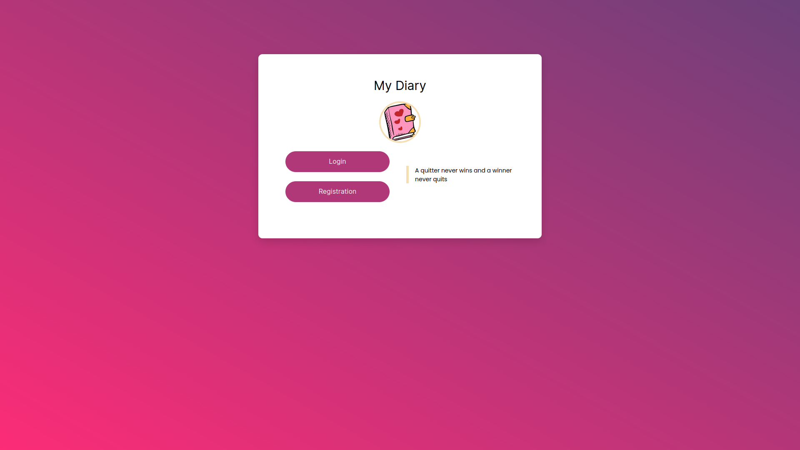

# My-Diary

### Project for Tinkerhub Co-coder event



# Project Name

Long Description about project. This project do that. This project is awesome...

## Team members

1. <a href="https://github.com/amjadcp/">Amjad C P</a>
2. <a href="https://github.com/Abbie2002/">Abbie Thankachan</a>

## Team Id

Python/210

## Link to product walkthrough

[](previews/preview.mp4)

## How it Works ?

1. Step 1
2. Step 2

## Libraries used

Library Name - Version

## Setup

The first thing to do is to clone the repository:

```sh
$ git clone https://github.com/amjadcp/diary-app.git
$ cd diary-app
```

Create a virtual environment to install dependencies in and activate it:

```sh
$ python -m venv env
$ source env/bin/activate
```

Then install the dependencies:

```sh
(E-shelf)$ pip install -r requirements.txt
```

Note the `(env)` in front of the prompt. This indicates that this terminal
session operates in a virtual environment set up by `virtualenv2`.

Once `pip` has finished downloading the dependencies:

create databse using

```sh
$ python manage.py migrate
```

Then run the server using

```sh
$ python manage.py runserver
```

And navigate to `http://127.0.0.1:8000/`.
